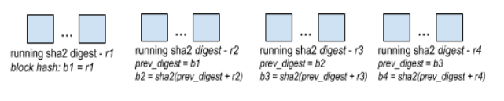

# fluent-plugin-sparkl

The [SPARKL](http://www.sparkl.com/) [Fluentd](http://fluentd.org/) filter plugin groups events into blocks that are 
chained together.  All events pass through unmodified, apart from the last in each set processed by the plugin (its filter_set 
function).  The last event has some additional meta-data inserted.

The chaining functionality, provided by the plugin, brings these benefits:
1. To catch **casual** modifications to events that may occur once they have been forwarded to some fluentd output such as mongodb.  
2. To provide a **strong** guarantee of integrity of events thanks to the periodic pushing of digests to a public blockchain via 
the Blockcypher API (or equivalent), capturing a fingerprint for all prior events (thanks to the chaining). 

Event non-repudiation is particularly useful for auditors, for example.    

For every set of events processed by the SPARKL filter, we calculate a running double-SHA256 digest over a mangled JSON representation of the events.  The events themselves remain untouched, but we transform them for the purpose of hashing so that 
the calculation is deterministic and reproducible when validating events against the generated chain.

For every last event in an event set processed by the plugin, we save block information under a *.sparkl* key in the event.  
This information contains:
  * *digest* - the running digest for the event set, shown with *r* labels in the following figure
  * *prev_digest* - the block digest of the previous block.  Block digests are shown with *b* labels in the following figure
  * ... other meta-data
  

  
The block digest for the new block is the double-SHA256 hash of the concatenation of *prev_digest* and *digest*.  
This will be saved under *prev_digest* in the next block.       

The tag of an event is used to determine the chain that its event set is added to.  Different event tags form different
blockchains. 

Whenever a certain number of blocks has been processed, or after a certain time has passed, a new block's digest 
(as calculated above) may be pushed to a public blockchain for additional certainty regarding the integrity of the chained events.  If the events prior and including the block can be shown to yield the pushed digest, then we can be strongly assured of the integrity event chain to this point.  See *Configuration*.
  
We push a 40-byte value comprising the concatenation of two 20-byte RMD160 digest strings.
The first 20 bytes is a RMD160 digest obtained from the first block digest concatenated with an index number which increments for
every block pushed to the public chain.  The key is thus different each time but reproducible.  `rmd160.hexdigest first_block_digest + pub_block_index`

The second 20 bytes is a RMD160 digest obtained directly from the block digest being pushed. 
`rmd160.hexdigest block_digest`
    
Constructing a key, thus, ensures further non-repudiation.  A party cannot claim that an event stream ended when it had not 
for instance.  An auditor would simply need to look on the public chain for an entry with the reconstructed next key which would have 
been pushed within a certain pubchain transaction window.    
  
The Blockcypher API is used for pushing block digests to a public chain.  
Currently, we have tried this functionality with `bcy/test`, `btc/test3`, and `btc/main` public chains.  
Pushing a digest to one of these chains yields a transaction id, and a timestring for when the block digest was received, 
both of which we save to the '.sparkl' hashmap.
  
When checking the events against the embedded chain, in order to verify their integrity, we grab the digest of the first block 
from the event chain.  This is used to generate the 20-byte RMD160 digest key for pubchain-pushed blocks.
  
We then traverse the chain, starting at its end, and check that each *prev_digest*, *digest* combination in a block yields the 
value of *prev_digest* in the next block.  

For each pubchain-block, we check that:
* the *received* timestring has not been modified in the block
* the data value stored within the pubchain transaction is expected: the first 20 bytes is the digest of the original block concatenated with the 
next expected index (decrements by 1, each time), and that second 20 bytes is the digest of the current chain block digest.

See: test/plugin/test_filter_sparkl.rb for an example of how to check the generated events and chain/s against the pubchain blocks.

This plugin is a simplfied version of the blockchain functionality available with the SPARKL Sequencing Engine.

*Note* - we may split the chaining functionality from the publishing functionality (via blockcypher) - points 1 and 2 in the list of benefits - for performance reasons.  At this time, this plugin is submitted to the fluentd community for experimentation.

## Installation

This plugin is v0.14 of fluentd compatible only. 

`gem build fluent-plugin-sparkl.gemspec`

`fluent-gem install fluent-plugin-sparkl-0.1.0.gem`

## Testing

Insert Blockcypher token into two places in test/plugin/test_filter_sparkl.rb, replacing `{{ coinnet_token }}`.

Then, `rake test`, with RUBYLIB environment variable set appropriately, e.g.:
`export RUBYLIB=$(find /opt/td-agent/embedded/lib/ruby/gems/2.4.0/gems -name "lib" -printf "%p:")`

## Configuration
1. Simple chaining of events - no pushing to public chain.
```
<filter pattern>
  @type sparkl
</filter>

```

2. Chaining of events with pushing to public chain every # of event sets.
```
<filter pattern>
  @type sparkl
  interval_type count
  action_interval 2   # every 2 event sets
  coinnet bcy/test    # use Blockcypher's test net
  coinnet_token fillthisin  # Blockcypher access token 
</filter>

```

3. Chaining of events with periodic pushing to public chain. 
```
<filter pattern>
  @type sparkl
  interval_type time
  action_interval 600 # every 10 minutes 
  coinnet bcy/test    # use Blockcypher's test net
  coinnet_token fillthisin  # Blockcypher access token 
</filter>

```

## Contributing
1. Fork it
2. Create your feature branch (git checkout -b my-new-feature)
3. Commit your changes (git commit -am 'Added some feature')
4. Push to the branch (git push origin my-new-feature)
5. Create new Pull Request

## Copyright

* Copyright(c) 2017- Andrew Farrell, SPARKL Limited.  All Rights Reserved.
* License
  * Apache License, Version 2.0
  